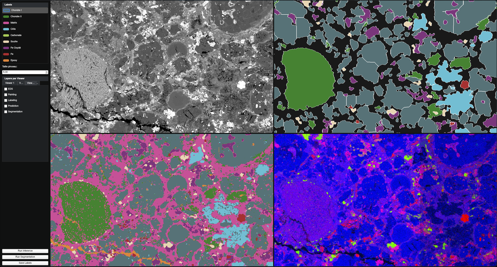

# Automated Chondrite Segmentation Pipeline

This repository contains the code, notebooks, and resources for the automated segmentation and analysis of chondritic meteorites, as described in our report. The pipeline combines **BSE imaging** and **EDS elemental maps** with a **patch-based convolutional neural network (PatchCNN)** and an **object-wise segmentation refinement**.

## Repository Structure

```
.
├── README.md
├── notebook           # Jupyter notebooks for experimentation and analysis
├── resources          # Weights, project files, shaders, and styles
├── viewer             # Interactive user interface
├── pyproject.toml     # Project configuration
├── run.sh             # Script to launch the pipeline
└── uv.lock
```

### Interactive User Interface

The features are:

* **Visualize multiple synchronized views** of the same meteorite region, each showing complementary information:
  * BSE map (structural reference)
  * EDS-derived elemental maps (MgSi, MgCaAl, FeSO)
  * Label map (manual annotations)
  * PatchCNN predictions
  * Object-wise segmentation map

* **Annotate**: Each class has a unique color, brush size is configurable, and annotations are synchronized across all views.

* **Save labels** for further analysis or retraining.

* **Inference** of the PatchCNN and the object-wise pipeline.

Below is an example screenshot of the viewer:



### Resources

* Pre-trained model weights: `resources/lcnn_weights.pth`
* Hyperparameters of the model: `resources/hp.json`
* Project configuration: `resources/project*.json`

#### Project Configuration (`project*.json`)

The `project*.json` file defines the images, views, and features used by the pipeline. Example:

```json
{
  "imgs": { "BSE": "Mosaic_BSE.tif", "Mg": "Mosaic_Mg.tif", "Si": "Mosaic_Si.tif" },
  "views": {
    "cols": 2, "rows": 2,
    "datas": [
      { "col": 0, "row": 0, "grayscale": true,  "r": "BSE" },
      { "col": 1, "row": 0, "grayscale": false, "r": "Mg", "g": "Si", "b": "0" }
    ]
  }
}
```

* **`imgs`**: maps channel names to image files.
* **`views`**: defines the viewer grid and which channels appear in each view (red/green/blue, or `0` if empty).


### Running the Pipeline

```bash
# Install dependencies
uv sync

# Launch the UI
./run.sh
```
